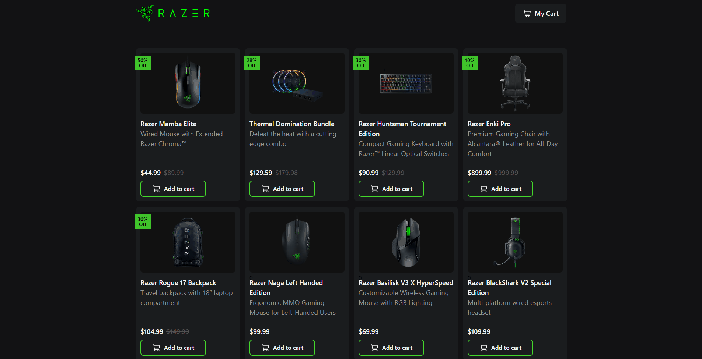

    <h2>⚜️ R A Z E R &nbsp; S H O P ⚜️</h2>

    <a href="#-project">Project</a>&nbsp;&nbsp;&nbsp;|&nbsp;&nbsp;&nbsp;
    <a href="#-technologies">Technologies</a>&nbsp;&nbsp;&nbsp;|&nbsp;&nbsp;&nbsp;
    <a href="#-features">Features</a>

 

<h3 align="center">
    
     
    <h3 align="center">
        <strong>
            <code>&nbsp;<a href="/">live demo</a>&nbsp;</code>
        </strong>
    </h3>
</h3>

 

## 📚 Project

Project developed to simulate an e-commerce, based on Razer products, containing real prices and their respective descriptions

It should be noted that prices may change over time, considering that the prices were based on the month of May 2023.

 

## 🖥 Technologies

- [React](https://react.dev/)
- [Next.Js](https://nextjs.org/)
- [TypeScript](https://www.typescriptlang.org/)
- [Tailwindcss](https://tailwindcss.com/)

 

## 🧾 Features

- [x] Add/remove products from cart
- [x] Dedicated pages for the products.
- [x] Simulation of payout when finalizing the order.
